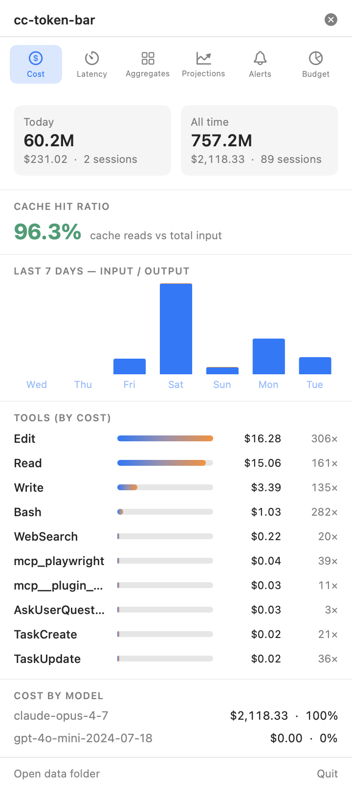
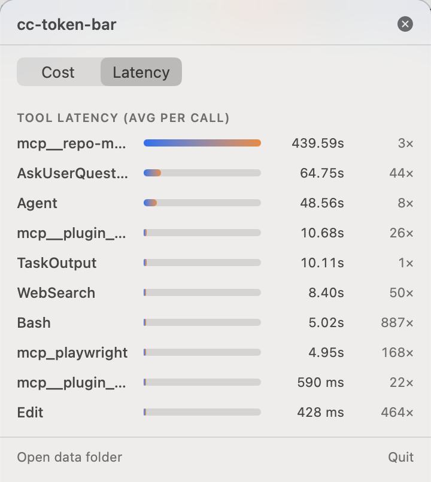
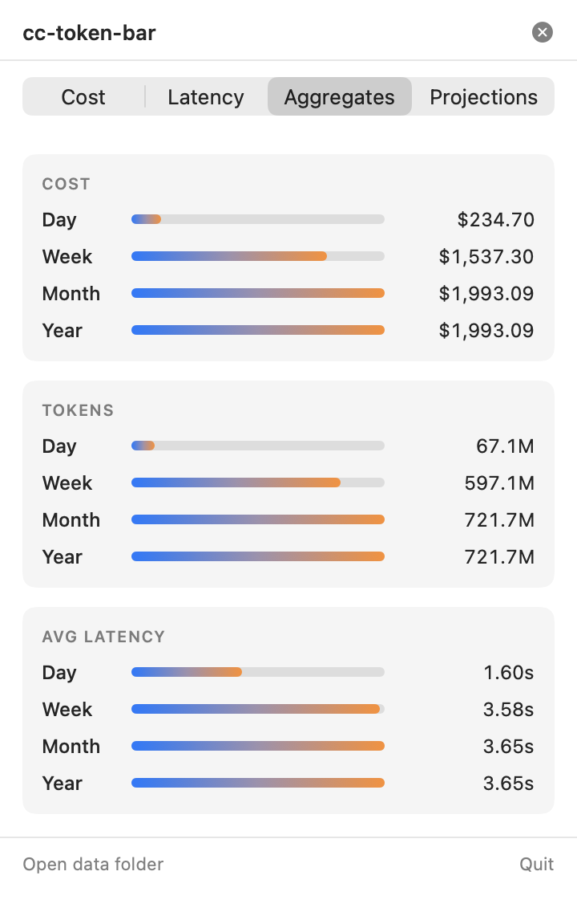
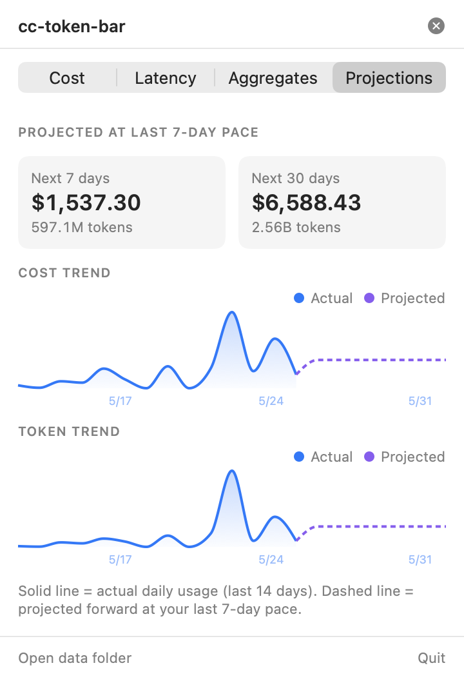

# cc-token-bar

<p align="center">
  
</p>

A native macOS menu bar app that surfaces Claude Code token usage, cost, and tool-by-tool breakdown — fed by hooks Claude Code already calls into. All data stays local.

<div align="center">
<table>
  <tr>
    <td align="center"><br/><b>Cost</b></td>
    <td align="center"><br/><b>Latency</b></td>
  </tr>
  <tr>
    <td align="center"><br/><b>Aggregates</b></td>
    <td align="center"><br/><b>Projections</b></td>
  </tr>
</table>
</div>

## What it shows

- **Today** and **lifetime** tokens + USD cost, with session counts.
- **Cache hit ratio** — the single number that tells you how efficient your prompt cache is.
- **Last 7 days** — stacked bar chart of input vs output tokens.
- **Tools by cost** — Read / Edit / Bash / Task / WebFetch ranked by estimated $.
- **Cost by model** — Opus vs Sonnet vs Haiku breakdown with % share.
- **Aggregates** — cost, tokens, and average tool latency rolled up over rolling windows: last 24h, 7d, 30d, 365d.
- **Projections** — next-7-day and next-30-day cost and token estimates, extrapolated from your last 7 days of usage.

Four tabs — **Cost**, **Latency**, **Aggregates**, **Projections** — switch the dropdown body via the segmented control under the title.

The menu bar item itself is just a bar-chart icon + the text **`cc`** — fixed-width so it doesn't fight your other menu bar apps for space (or get eaten by the MacBook notch).

## Why

Claude Code already writes rich usage data under `~/.claude/` — transcripts have per-message `usage.input_tokens` / `output_tokens` / `cache_*`, `.session-stats.json` has tool counts, `stats-cache.json` has daily rollups. None of it is surfaced. `cc-token-bar` reads it, prices it, and shows the totals in your menu bar.

## Architecture

```
~/.claude/                              ~/.cc-token-bar/                 cc-token-bar.app
├── projects/<enc>/<sid>.jsonl  ──┐    ├── bin/hook.sh                  ├── NSStatusItem + NSPopover
├── .session-stats.json           │    ├── sessions/<sid>.json   ◀──┐   ├── SwiftUI PanelView
├── stats-cache.json              │    ├── tools/<sid>.json      ◀──┤   ├── DataStore (ObservableObject)
└── history.jsonl                 │    ├── state/                     │   ├── FSWatcher (FSEvents)
                                  │    └── config.json (pricing)      │   └── Pricing (per-model rates)
                                  │                                   │
   Claude Code hook events  ──────┴──▶ hook.sh aggregates transcripts ┘
   (PostToolUse, Stop, SessionEnd)
                                                                ┌──── FSEvents (file-level, atomic rename safe)
                                                                ▼
                                                       refresh @ 250ms debounce
                                                       30s fallback timer
```

Three moving parts:

1. **`hook/hook.sh`** — fires on `PostToolUse` / `Stop` / `SessionEnd`. Reads `transcript_path` from stdin, aggregates per-model `usage` with `jq`, writes `~/.cc-token-bar/sessions/<sid>.json` and `~/.cc-token-bar/tools/<sid>.json` via atomic rename.
2. **`~/.cc-token-bar/`** — flat JSON files. One per session for tokens, one per session for tool counters. `config.json` holds the pricing table (editable).
3. **`cc-token-bar.app`** — native Swift + SwiftUI (macOS 13+), no third-party libraries. `NSStatusItem` for the menu bar slot, `NSPopover` for the dropdown, `NSHostingController` to bridge SwiftUI in.

## Live updates

The dropdown refreshes within ~1 second of any new data. End-to-end flow:

```
Claude Code finishes a turn
   │
   ▼
hook.sh writes  ~/.cc-token-bar/sessions/<id>.json  via  mv tmp target
   │
   ▼
FSEventStream (kFSEventStreamCreateFlagFileEvents) fires
   │
   ▼
DataStore.scheduleRefresh()  (debounced 250 ms)
   │
   ▼
JSON reload off the main queue
   │
   ▼
@Published agg updates on main thread
   │
   ▼
SwiftUI re-renders the open popover  ←  ALSO: 30 s polling timer as fallback
```

A 30-second polling timer covers the rare case where FSEvents drops a notification. You don't need to close and reopen the dropdown — leave it open and watch numbers tick.

## Install

Requirements: macOS 13+, `swift` toolchain, `jq`.

```bash
./install.sh                 # base install
./install.sh --autostart     # also installs a LaunchAgent for login start
./install.sh --no-paths      # privacy mode: don't store project paths
```

The installer:

1. Creates `~/.cc-token-bar/{bin,sessions,tools,state}`.
2. Installs `hook.sh`.
3. Writes default `config.json` with current Opus / Sonnet / Haiku pricing (editable).
4. Backs up `~/.claude/settings.json` and merges in `PostToolUse` / `Stop` / `SessionEnd` hook entries (idempotent — re-runs are safe).
5. Builds the app with `swift build -c release`.
6. Wraps the binary in `/Applications/cc-token-bar.app/Contents/{MacOS,Info.plist}` with `LSUIElement=true`.
7. **Backfills** by replaying every existing `~/.claude/projects/**/*.jsonl` through the hook so you see history immediately.
8. (Optional) installs `~/Library/LaunchAgents/com.cc-token-bar.plist` and loads it.
9. Launches the app.

## Uninstall

```bash
./uninstall.sh               # removes everything
./uninstall.sh --keep-data   # leaves ~/.cc-token-bar/ in place
```

Mirrors install in reverse: unloads & removes LaunchAgent, kills the app, removes the bundle, strips hook entries from `~/.claude/settings.json` (with backup), removes `~/.cc-token-bar/` unless `--keep-data`.

## Configuration

`~/.cc-token-bar/config.json` is user-editable:

```json
{
  "version": 1,
  "store_project_paths": true,
  "pricing": {
    "claude-opus-4":   {"input": 15.0, "output": 75.0, "cache_write": 18.75, "cache_read": 1.50},
    "claude-sonnet-4": {"input":  3.0, "output": 15.0, "cache_write":  3.75, "cache_read": 0.30},
    "claude-haiku-4":  {"input":  1.0, "output":  5.0, "cache_write":  1.25, "cache_read": 0.10}
  }
}
```

Model keys match by prefix — anything starting with `claude-opus-4` (4.5, 4.6, 4.7, …) hits the Opus tier. Add your own keys for fine-tuning or for future models.

## Tech stack

- **Swift 5.9 + SwiftUI + AppKit + CoreServices** — built with Swift Package Manager, zero third-party dependencies.
- **`NSStatusItem` + `NSPopover` + `NSHostingController`** — chosen over `MenuBarExtra` because SwiftPM-built apps using `MenuBarExtra` were unreliable on macOS 26.
- **`FSEventStreamCreate`** with file-level events — drives the live refresh.
- **`jq` + bash** — for the hook. No Python, no Node.
- **`Charts` framework** — system-provided stacked bar chart, no third-party charting lib.

## Layout

```
cc-token-bar/
├── README.md                              this file
├── design-doc.md                          full design with all decisions locked
├── preview.html                           original UI mock (open in a browser)
├── install.sh
├── uninstall.sh
├── hook/
│   └── hook.sh                            jq-based aggregator, called by Claude Code
└── app/
    ├── Package.swift
    ├── Info.plist                         LSUIElement=true → menu bar only
    └── Sources/cc-token-bar/
        ├── main.swift                     classic NSApplication.shared.run() entry
        ├── App.swift                      AppDelegate: NSStatusItem + NSPopover
        ├── Models.swift                   Codable types + aggregates
        ├── Pricing.swift                  per-million pricing + prefix model match
        ├── DataStore.swift                ObservableObject, scans + aggregates
        ├── FSWatcher.swift                CoreServices FSEvents wrapper
        ├── Snapshot.swift                 --snapshot mode: render tabs to PNG for docs
        └── Views.swift                    SwiftUI PanelView (4 tabs: cost, latency, aggregates, projections)
```

## Design

Full design — including data sources, metrics catalog, attribution model, and every locked decision — lives in [**design-doc.md**](./design-doc.md).

## Result

The dropdown has four tabs — **Cost**, **Latency**, **Aggregates**, and **Projections** — switched by the segmented control under the title (see the four screenshots at the top of this README). All of them run against real Claude Code data on this machine: 88 sessions, 96.6 % cache hit ratio.

### Cost tab

The default view — where your tokens and dollars go. Top to bottom:

- **Header KPIs** — `Today` and `All time` token counts with the running USD cost and session count. Tokens are formatted compactly (`124.2M`); cost uses monospaced digits so the column never jitters as numbers grow.
- **Cache hit ratio** — `96.6%` in green (the threshold is 60 %; below that it turns orange). This is `cache_reads / (cache_reads + cache_writes + input)` across all sessions — the most actionable single number for spotting prompt cache regressions.
- **Last 7 days** — stacked bar chart, input (blue) over output (orange). The one heavy day shows clearly as the tall Saturday bar.
- **Tools by cost** — each row: tool name, gradient bar normalized to the top spender, $ cost, invocation count. Cost is estimated from `tool_input + tool_response` bytes ÷ 4, priced at the per-session weighted input rate. `Read` and `Edit` dominate the spend here.
- **Cost by model** — every model the hook has seen, with $ and % share. Models without pricing entries (synthetic helpers, third-party adapters) show `$0.00` rather than crashing.

### Latency tab

The same tools, re-ranked by **average wall-clock time per call** instead of by cost — answering "what's making me wait" rather than "what's burning tokens":

- **Tool latency (avg per call)** — each row: tool name, gradient bar normalized to the slowest tool, average duration, invocation count. Durations auto-format across units (`439.59s`, `590 ms`, `428 ms`) from the elapsed time the hook records between a tool firing and its `PostToolUse` event.
- Slow orchestration tools float to the top — `mcp__repo-*` at `439.59s` over just `3×` calls, `AskUserQuestion` and `Agent` in the tens of seconds — while the high-frequency primitives sink to the bottom: `Bash` averages `5.02s` but ran `887×`, and `Edit` averages just `428 ms` across `464×`. Cost and latency rank the tool list very differently.

### Aggregates tab

The same cost, token, and latency numbers — but rolled up over **rolling trailing windows**, one card **per metric**:

- Three cards — **Cost**, **Tokens**, **Avg latency** — each with a row for every window: **Day** = last 24h, **Week** = last 7 days, **Month** = last 30 days, **Year** = last 365 days. These are rolling windows, not calendar periods — "Week" always means the trailing seven days, with no Monday reset.
- Within a card each row has a **gradient bar** scaled to that card's largest window, so you read the four windows against each other at a glance. A session counts toward a window when its last activity falls inside it; the windows nest, so a session three days old contributes to Week, Month, and Year but not Day.
- In the shot above Month and Year are identical in every card (`$1,993.09`, `721.7M`, `3.65s`) because this machine's tracked history is younger than 30 days — there are no sessions older than a month yet, so both windows capture the same set. That's the honest readout, not a placeholder.
- Cost and tokens grow with the window (cumulative), so their bars climb Day → Year; **average latency** doesn't accumulate, so that card is a genuine side-by-side comparison — here recent calls (`1.60s` today) are faster than the longer-run average (`3.65s`).

### Projections tab

A forward-looking run-rate built from **actual recent consumption**, with the trend drawn out as charts:

- Two cards — **Next 7 days** (`$1,537.30` / `597.1M` tokens) and **Next 30 days** (`$6,588.43` / `2.56B` tokens) — each a projected **cost** and **token** count.
- Two **trend charts**, one for cost and one for tokens. Each plots the **last 14 days of actual daily usage** as a solid blue line with a filled area, then a **dashed violet line** projecting 7 days forward at your current pace. The dashed line connects to the last real point, so you read the past and the projection as one continuous shape.
- Everything extrapolates your *last 7 days*: a daily rate (`7-day total ÷ 7`) × 7 for the week and × 30 for the month. It's a current-pace projection, not a calendar forecast — it answers "if I keep working like I did this past week, what will it cost", and it moves as your recent usage moves.

The footer is shared by every tab: `Open data folder` reveals `~/.cc-token-bar/` in Finder so you can inspect the raw JSON; `Quit` exits cleanly (the LaunchAgent will respawn it on next login).
